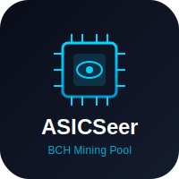

<p align="center">
  
</p>

# ASICSeer for StartOS

<p align="center">
  
  
  
</p>

**ASICSeer** is a Bitcoin Cash mining pool for [StartOS](https://start9.com), powered by [ASICSeer Pool](https://github.com/cculianu/asicseer-pool) — fast, C-based, multithreaded mining pool software for Bitcoin Cash. It provides **dual-mode** operation — pool mining and solo mining — with a built-in web dashboard.

## Features

- **Pool Mining** (port 3334) — Shared block rewards among all miners
- **Solo Mining** (port 4568) — Winner takes the entire block reward
- **Web Dashboard** (port 81) — Real-time hashrate, workers, blocks found
- **Stratum Protocol** — Compatible with all ASIC miners (Antminer, Whatsminer, Bitaxe, etc.)
- **Auto-configured** — Automatically connects to your Bitcoin Cash Node (BCHN or BCHD)
- **Multi-architecture** — Runs on x86_64 and aarch64

## Architecture

```
┌─────────────────────────────────────────────────────┐
│                  ASICSeer Package                     │
│                                                      │
│  ┌──────────────┐  ┌──────────────┐  ┌────────────┐ │
│  │  Pool daemon  │  │  Solo daemon  │  │  Web UI    │ │
│  │  :3334       │  │  :4568       │  │  :81       │ │
│  │  (shared)    │  │  (solo)      │  │  (nginx)   │ │
│  └──────┬───────┘  └──────┬───────┘  └─────┬──────┘ │
│         │                 │                │         │
│         └────────┬────────┘                │         │
│                  │                         │         │
│         ┌───────▼────────┐     ┌──────────▼───────┐ │
│         │  /data volume  │     │  stats-api.sh    │ │
│         │  (asicseer)    │◄────│  (ckpmsg → JSON) │ │
│         └───────┬────────┘     └──────────────────┘ │
│                 │                                    │
└─────────────────┼────────────────────────────────────┘
                  │ RPC (8332)
         ┌────────▼────────┐
         │  Bitcoin Cash   │
         │  Node (BCHN     │
         │  or BCHD)       │
         └─────────────────┘
```

## Dependencies

| Package | Required | Notes |
|---------|----------|-------|
| **Bitcoin Cash Node** | Yes | BCHN or BCHD flavor. Must be fully synced with txindex enabled. |

## Quick Start

1. **Install Bitcoin Cash Node** on your StartOS server and wait for full sync
2. **Install ASICSeer** from the marketplace
3. **Configure** — Set your BCH payout address via Actions → Configure
4. **Point your miners** at:
   - Pool mode: `stratum+tcp://<your-server>:3334`
   - Solo mode: `stratum+tcp://<your-server>:4568`
5. **Monitor** via the Web Dashboard

### Miner Configuration

| Setting | Value |
|---------|-------|
| **URL** | `stratum+tcp://<host>:3334` (pool) or `:4568` (solo) |
| **Username** | Your BCH address |
| **Password** | Anything (or `d=DIFFICULTY` for custom difficulty) |

## Running StartOS in a Virtual Machine

If you run StartOS inside a **libvirt/KVM virtual machine** (e.g. via `virt-manager`), miners on your local network cannot reach the VM directly because libvirt uses a NAT bridge (`virbr0`). You need to forward the mining ports from your host machine to the VM.

This works with **any connection type** — wired (Ethernet), wireless (WiFi), or both simultaneously.

### One-Command Setup (Linux)

Download and run the setup script:

```bash
curl -fsSL https://raw.githubusercontent.com/BitcoinCash1/bch-asicseer-startos/master/scripts/setup-vm-forwarding.sh -o setup-vm-forwarding.sh
chmod +x setup-vm-forwarding.sh
sudo ./setup-vm-forwarding.sh
```

That's it. The script will:

1. Auto-detect your StartOS VM and its IP address
2. Pin the VM's IP so it doesn't change on reboot (static DHCP lease)
3. Install a [libvirt qemu hook](https://wiki.libvirt.org/Networking.html#forwarding-incoming-connections) that automatically forwards ports whenever the VM starts
4. Detect **all** your physical network interfaces (wired + wireless) and forward on each
5. Print the exact stratum URLs to use for your miners

```
$ sudo ./setup-vm-forwarding.sh
[OK] Found VM: Start9OS
[OK] VM IP: 192.168.122.129
[OK]   eno1 (192.168.0.55)          ← wired
[OK]   wlp4s0 (192.168.0.156)      ← wireless
[OK] Hook installed at /etc/libvirt/hooks/qemu
[OK] Forwarding rules active

  Miner configuration — use ANY of these addresses:

    via eno1 (192.168.0.55):
      ASICSeer:       stratum+tcp://192.168.0.55:3334
      ASICSeer Solo:  stratum+tcp://192.168.0.55:4568

    via wlp4s0 (192.168.0.156):
      ASICSeer:       stratum+tcp://192.168.0.156:3334
      ASICSeer Solo:  stratum+tcp://192.168.0.156:4568
```

### Management Commands

```bash
# Check current status
sudo ./setup-vm-forwarding.sh --status

# Completely remove (restores system to default)
sudo ./setup-vm-forwarding.sh --remove

# Specify VM name manually (if auto-detect fails)
sudo ./setup-vm-forwarding.sh "My StartOS VM"
```

### How It Works

The script installs `/etc/libvirt/hooks/qemu` — the [official libvirt hook mechanism](https://wiki.libvirt.org/Networking.html#forwarding-incoming-connections). When the VM starts, the hook adds `iptables` DNAT rules that forward incoming connections on ports 3334, 4568, and 81 from every physical network interface to the VM. When the VM stops, the rules are automatically removed.

```
┌─────────────┐     ┌──────────────────┐     ┌──────────────────┐
│   Miner     │────▶│  Host Machine    │────▶│  StartOS VM      │
│ 192.168.0.x │     │  eno1/wlp4s0     │     │  192.168.122.x   │
│             │     │  (iptables DNAT) │     │  (virbr0 NAT)    │
└─────────────┘     └──────────────────┘     └──────────────────┘
  stratum+tcp://       port forwarding          asicseer listening
  192.168.0.55:3334    3334 → VM:3334           on :3334
```

No bridges, no NetworkManager changes, no DNS changes. Just iptables rules managed by the official libvirt hook system.

### Windows / macOS (VirtualBox, VMware, etc.)

If you run StartOS in **VirtualBox** or **VMware**:

1. **Bridged Networking (recommended):** Change the VM's network adapter to "Bridged" mode. The VM will get its own IP on your LAN and miners can connect directly — no port forwarding needed.

2. **NAT with Port Forwarding:** If you must use NAT mode:
   - **VirtualBox:** `VBoxManage modifyvm "StartOS" --natpf1 "pool,tcp,,3334,,3334" --natpf1 "solo,tcp,,4568,,4568" --natpf1 "web,tcp,,81,,81"`
   - **VMware:** Edit the NAT configuration in `vmnetcfg.exe` (Windows) or `/Library/Preferences/VMware Fusion/vmnet8/nat.conf` (macOS) to add port forwards for 3334, 4568, and 81.

For **Hyper-V** on Windows, use an External virtual switch (equivalent to bridged mode).

### Troubleshooting

| Problem | Solution |
|---------|----------|
| Script says "VM not found" | Run `virsh list --all` to see VM names, then pass it: `sudo ./setup-vm-forwarding.sh "exact name"` |
| Script says "Cannot determine VM IP" | Start the VM first, wait 30 seconds for it to get an IP, then run again |
| Miner connects but pool shows no hashrate | Check that the pool service is running on StartOS (Actions → Start) |
| Port forwarding stops after reboot | The hook should auto-apply when the VM starts. Run `sudo ./setup-vm-forwarding.sh --status` to verify the hook file exists |
| Want to undo everything | `sudo ./setup-vm-forwarding.sh --remove` restores your system completely |

## Building from Source

```bash
# Prerequisites: StartOS SDK, Docker, Node.js 20+
git clone https://github.com/BitcoinCash1/bch-asicseer-startos.git
cd bch-asicseer-startos
npm install
make
```

## Port Allocation

| Port | Protocol | Purpose |
|------|----------|---------|
| 3334 | Stratum (TCP) | Pool mining |
| 4568 | Stratum (TCP) | Solo mining |
| 81 | HTTP | Web dashboard |

## Configuration Options

| Option | Default | Description |
|--------|---------|-------------|
| Payout Address | *(required)* | BCH address for coinbase rewards |
| Pool Fee | 1% | Fee percentage for pool mode (solo is always 0%) |
| Pool Identifier | `ASICSeer` | Coinbase signature visible on block explorers |
| Starting Difficulty | 64 | Initial share difficulty for new workers |

## How It Works

ASICSeer runs two independent mining daemon instances from the same Docker image:
- **Pool instance** shares rewards proportionally based on submitted shares
- **Solo instance** directs the entire block reward to whichever miner finds it

Both instances connect to your Bitcoin Cash Node via RPC. The web dashboard uses `ckpmsg` to query ASICSeer's Unix domain sockets and serves stats as static JSON via nginx.

You can point different miners to different modes simultaneously — no reconfiguration needed.

## EloPool vs ASICSeer

Both packages are ckpool forks with the same dual-mode architecture. They use **different ports** so you can run both simultaneously:

| Feature | EloPool | ASICSeer |
|---------|---------|----------|
| Pool Port | 3333 | 3334 |
| Solo Port | 4567 | 4568 |
| Web UI Port | 80 | 81 |
| Upstream | [skaisser/ckpool](https://github.com/skaisser/ckpool) | [cculianu/asicseer-pool](https://github.com/cculianu/asicseer-pool) |

## Upstream

- [cculianu/asicseer-pool](https://github.com/cculianu/asicseer-pool) — Fast, C-based, multithreaded mining pool software for Bitcoin Cash
- [bitcoin-cash-node](https://github.com/bitcoin-cash-node/bitcoin-cash-node) — Bitcoin Cash full node

## License

GPL-3.0 — matches upstream ASICSeer Pool license.

---

<details>
<summary><strong>AI Reference Prompt</strong></summary>

```yaml
package: bch-asicseer
type: startos-service
sdk: "@start9labs/start-sdk@1.0.0"
upstream: cculianu/asicseer-pool
depends_on: bitcoin-cash-node (BCHN or BCHD)
ports:
  pool: 3334 (stratum)
  solo: 4568 (stratum)
  ui: 81 (http)
daemons: 3 (pool-asicseer, solo-asicseer, ui-nginx)
volumes: main (/data)
dependency_mount: /mnt/bitcoin-cash-node (reads store.json for RPC creds)
critical_tasks: txindex=true, prune=null, zmqEnabled=true
config_fields: payoutAddress, poolFee, poolIdentifier, poolDifficulty
webui: nginx serving static HTML + stats-api.sh background (ckpmsg → JSON)
build: multi-stage Docker (ubuntu build-asicseer → node:20-bookworm-slim runtime)
```

</details>
